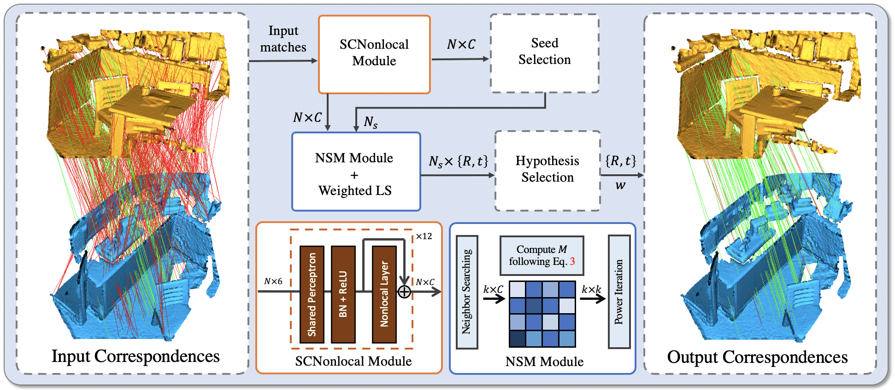

# PointDSC repository

PyTorch implementation of PointDSC for CVPR'2021 paper ["PointDSC: Robust Point Cloud Registration using Deep Spatial Consistency"](), by Xuyang Bai, Zixin Luo, Lei Zhou, Hongkai Chen, Lei Li, Zeyu Hu, Hongbo Fu and Chiew-Lan Tai.

This paper focus on outlier rejection for 3D point clouds registration. If you find this project useful, please cite:

```bash
@article{bai2021pointdsc,
  title={{PointDSC}: {R}obust {P}oint {C}loud {R}egistration using {D}eep {S}patial {C}onsistency},
  author={Xuyang Bai, Zixin Luo, Lei Zhou, Hongkai Chen, Lei Li, Zeyu Hu, Hongbo Fu and Chiew-Lan Tai},
  journal={arXiv: [cs.CV]},
  year={2021}
}
```

## Introduction

Removing outlier correspondences is one of the critical steps for successful feature-based point cloud registration. Despite the increasing popularity of introducing deep learning techniques in this field, spatial consistency, which is essentially established by a Euclidean transformation between point clouds, has received almost no individual attention in existing learning frameworks. In this paper, we present PointDSC, a novel deep
neural network that explicitly incorporates spatial consistency for pruning outlier correspondences. First, we propose a nonlocal feature aggregation module, weighted by both feature and spatial coherence, for feature embedding of the input correspondences. 
Second, we formulate a differentiable spectral matching module, supervised by pairwise spatial compatibility, to estimate the inlier confidence of each correspondence from the embedded features.
With modest computation cost, our method outperforms the state-of-the-art hand-crafted and learning-based outlier rejection approaches on several real-world datasets by a significant margin. We also show its wide applicability by combining PointDSC with different 3D local descriptors.




## Requirements

If you are using conda, you may configure PointDSC as:

    conda env create -f environment.yml
    conda activate pointdsc

If you also want to use FCGF as the 3d local descriptor, please install [MinkowskiEngine](https://github.com/NVIDIA/MinkowskiEngine) and download the FCGF model (pretrained on 3DMatch) from [here](http://node2.chrischoy.org/data/projects/DGR/ResUNetBN2C-feat32-3dmatch-v0.05.pth). 

## Demo

We provide a small demo to extract dense FPFH descriptors for two point cloud, and register them using PointDSC. The ply files are saved in the `demo_data` folder, which can be replaced by your own data.  Please use model pretrained on 3DMatch for indoor RGB-D scans and model pretrained on KITTI for outdoor LiDAR scans. To try the demo, please run
```bash
python demo_registration.py --chosen_snapshot [PointDSC_3DMatch_release/PointDSC_KITTI_release]
``` 
For challenging cases, we recommend to use learned feature descriptors like [D3Feat](https://github.com/XuyangBai/D3Feat) or [FCGF](https://github.com/chrischoy/FCGF). 

## Dataset Preprocessing

### 3DMatch

The raw point clouds of 3DMatch can be downloaded from [FCGF repo](http://node2.chrischoy.org/data/datasets/registration/threedmatch.tgz). The test set point clouds and the ground truth poses can be downloaded from [3DMatch Geometric Registration website](http://3dmatch.cs.princeton.edu/#geometric-registration-benchmark). 
Please make sure the data folder contains the following:

```
.                          
├── fragments                 
│   ├── 7-scene-redkitechen/       
│   ├── sun3d-home_at-home_at_scan1_2013_jan_1/      
│   └── ...                
├── gt_result                   
│   ├── 7-scene-redkitechen-evaluation/   
│   ├── sun3d-home_at-home_at_scan1_2013_jan_1-evaluation/
│   └── ...         
├── threedmatch            
│   ├── *.npz
│   └── *.txt                            
```

To reduce the training time, we pre-compute the 3D local descriptors (FCGF or FPFH) so that we can directly build the input correspondence using NN search during training. Please use `misc/cal_fcgf.py` or `misc/cal_fpfh.py` to extract FCGF or FPFH descriptors. [Here](https://drive.google.com/file/d/1zuf6NSD3-dHtTpk34iHtxAf8DQx3Y7RH/view?usp=sharing) we provide the pre-computed descriptors for the 3DMatch test set. 

### KITTI

The raw point clouds can be download from [KITTI Odometry website.](http://www.cvlibs.net/datasets/kitti/eval_odometry.php) Please follow the similar steps as 3DMatch dataset for pre-processing.

### Augmented ICL-NUIM

Data can be downloaded from [Redwood website](http://redwood-data.org/indoor/dataset.html). Details can be found in `multiway/README.md`

## Pretrained Model

We provide the pre-trained model of 3DMatch in `snapshot/PointDSC_3DMatch_release` and KITTI in `snapshot/PointDSC_KITTI_release`.


## Instructions to training and testing

### 3DMatch

The training and testing on 3DMatch dataset can be done by running
```bash
python train_3dmatch.py

python evaluation/test_3DMatch.py --chosen_snapshot [exp_id] --use_icp False
```
where the `exp_id` should be replaced by the snapshot folder name for testing (e.g. `PointDSC_3DMatch_release`).  The testing results will be saved in `logs/`. The training config can be changed in `config.py`. We also provide the scripts to test the traditional outlier rejection baselines on 3DMatch in `baseline_scripts/baseline_3DMatch.py`.

### KITTI

Similarly, the training and testing of KITTI data set can be done by running
```bash
python train_KITTI.py

python evaluation/test_KITTI.py --chosen_snapshot [exp_id] --use_icp False
```
We also provide the scripts to test the traditional outlier rejection baselines on KITTI in `baseline_scripts/baseline_KITTI.py`.


### Augmemented ICL-NUIM
The detailed guidance of evaluating our method in multiway registration tasks can be found in `multiway/README.md`

### 3DLoMatch
We also evaluate our method on a recently proposed benchmark 3DLoMatch following [OverlapPredator](https://github.com/ShengyuH/OverlapPredator),
```bash
python evaluation/test_3DLoMatch.py --chosen_snapshot [exp_id] --descriptor [fcgf/predator] --num_points 5000
```
If you want to evaluate `predator` descriptor with PointDSC, you first need to follow the offical instruction of [OverlapPredator](https://github.com/ShengyuH/OverlapPredator) to extract the features. 


## Contact
If you run into any problems or have questions, please create an issue or contact xbaiad@connect.ust.hk


## Acknowledgments
We thank the authors of 
- [FCGF](https://github.com/chrischoy/FCGF)
- [DGR](https://github.com/chrischoy/DeepGlobalRegistration)
- [TEASER](https://github.com/MIT-SPARK/TEASER-plusplus)
- [3DRegNet](https://github.com/goncalo120/3DRegNet) 
- [OverlapPredator](https://github.com/ShengyuH/OverlapPredator)

for open sourcing their methods.